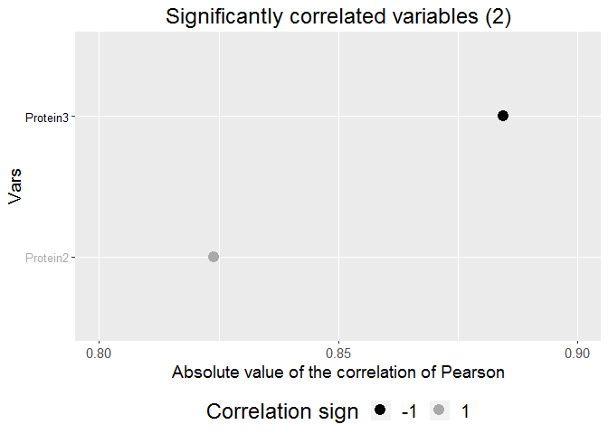

Management of proteomic data to identify differentially abundant proteins according to one discriminant factor and to correlate their abundance with the value of this factor
================
Jeanne BAZILE, Ioana MOLNAR, Brigitte PICARD, Muriel BONNET

DOI : 10.5281/zenodo.2539329

The R version used for this example is 3.3.2.

The purpose of this document is to present an example of script used to: - discriminate differentially abundant values of an item assayed (here protein abundance) between 2 groups differing by one discriminant factor (here the adiposity) - to assess the correlation between the item values and the discriminant factor.

For the purpose of this example, we use the following data set: "example\_data\_set.csv", provided in the present repository. First, read the data from file

``` r
setwd("~/articles/data-paper_script")
datafr = read.csv2("example_data_set.csv", sep=";", dec=".")
```

the data set is organized as follows :

| group  |   id|  adiposity|   Protein1|  Protein2|  Protein3|  Protein4|
|:-------|----:|----------:|----------:|---------:|---------:|---------:|
| group1 |    1|        6.3|  230795072|  72392559|  -1308293|     54238|
| group1 |    6|        3.7|  267670438|  49956496|  -1099355|     23984|
| group1 |    3|        4.1|    1736366|  57744002|  -1188752|   3574699|
| group1 |    4|        5.1|   72392559|  65141951|  -1234186|    368571|
| group1 |    5|        6.8|  203517615|  64672505|  -1551479|     65781|
| group2 |    2|        3.0|  275028504|  64089037|  -1125215|   5348673|
| group2 |    7|        2.1|    2043358|  41658946|  -1132811|    687253|
| group2 |    8|        2.2|   64089037|  50876533|  -1049944|     68357|
| group2 |    9|        2.3|  231769965|  37805488|  -1134805|    573521|
| group2 |   10|        2.2|  305818430|  39682550|  -1086689|     68967|

Our data set contains 7 columns, labelled: - 1, "group", is the grouping variable. In this example, it is a factor with two levels: "group1" and "goup2". - 2, "id", contains the identifier of the sample. It may be numeric or alphanumeric, and it must be unique. - 3, "adiposity", is a continuous variable for the discriminating factor, reprensenting in our case the measured percentage of intramuscular adiposity by animal. It was also used to group the sample in the "group" column (using the threshold of 3.5% of adiposity, done manually)

Once the data set is ready, download the following required libraries:

``` r
library(broom) ## glance used in plotCorr function
library(factoextra) ## fviz used in plotCorr function
library(seriation) ## seriate used in plotCorr function
library(superheat) ## superheat used in plotCorr function
library(Hmisc) ## rcorr to get the correlation and the pvalue of the correlation
```

Definition of the plotCorr function
-----------------------------------

The purpose of the function plotCorr, provided in this repository, is to draw a correlation plot between the discriminant factor, in our example beteween adiposity values and a protein abundance. The positive or negative correlation of the proteins to adiposity, ranked according to the level of significance (p-value), will be shown on the plot .

The signature of the function is the following:

``` r
#' @param vect A numeric vector.
#' @param vars A numeric data frame, with number of rows equal to the length of
#' the vector vect.
#' @param type Correlation method to pass to stats::cor.test function.
#' Possible values : "pearson", "kendall", or "spearman".
#' @param seuil Significance cut-off value. Default is 0.05.
#' @param filename To save plot on disk, provide filename without the extension.
#' If NULL, the plot is only returned but not saved.
#' @param plottitle Plot title. If NULL, a default title will be used.
#' @param color.positive Colour of the points in the plot that correspond to
#' positive significant correlation coefficient. Default is "darkgrey".
#' @param color.negative Colour of the points in the plot that correspond to
#' negative significant correlation coefficient. Default is "black".
#' @return The correlation coefficients.

plotCorr = function(vect, vars,
                    type=c("pearson", "kendall", "spearman"), seuil=.05,
                    filename=NULL, plottitle=NULL,
                    color.positive="darkgrey", color.negative="black")
```

The first two arguments are compulsory: - vect : a numeric vector - vars : a numeric dataframe

The function plotCorr computes the correlations between vect and each variable in vars and creates a plot with the significant correlation coefficients.

The following specification can be changed : - type : the correlation method passed to the cor.test function. See ?cor.test for more details - seuil : the alpha of the probability test. Usually set at 0.05, it is sometimes set at 0.1 to detect tendencies - file name : if a filename is provided, the plot will be saved on disk as a png image (the extension .png is added automatically, do not specify it) - plottitle : if specified, overwrite the default plot title - color.negative and color.positive : color of the point used in the plot. By default, a black and white figure is produced.

``` r
source("plotCorr.R")
```

Define useful objects
---------------------

We define the following objects

``` r
varnames = colnames(datafr)[-(1 : 3)] ## vector of variable names
data.prot = datafr[, varnames]
var.factor = datafr[, "group"] 
var.lim = datafr[, "adiposity"] #Need to be changed according to your "discriminant value" i.e. you need to refer to the name of the 3rd column
nvars = ncol(data.prot)
alpha = 0.05 
df.res = data.frame(matrix(ncol=0, nrow=ncol(data.prot)))
```

Results
=======

Test of normality and wether the proteins or genes are differentially abundant or expressed
-------------------------------------------------------------------------------------------

``` r
#Shapiro test if the data follows a normale distribution
df.res$pval.shapiro = sapply(1 : nvars, function(i) shapiro.test(data.prot[, i])$p.value)
df.res$normality = sapply(df.res$pval.shapiro, function(x) ifelse(x < alpha, F, T))

#Then, according to True or False, T test (for TRUE value, meaning they are following a normal distribution) or Kruskal-Wallis (for FALSE results) are performed
df.res$pval.testTorKW = sapply(1 : nvars, function(i) {
    if (df.res$normality[i]) glance(lm(data.prot[, i] ~ var.factor))$p.value
    else glance(kruskal.test(data.prot[, i] ~ var.factor))$p.value
})
df.res$signif.testTorKW = sapply(df.res$pval.testTorKW, function(x) ifelse(x < alpha, T, F)) #tell you if it's significative or not

#Give  results of T test and Kruskal-Wallis in any case 
df.res$pval.Ttest = sapply(1 : nvars, function(i) glance(lm(data.prot[, i] ~ var.factor))$p.value)
df.res$signif.Ttest = sapply(df.res$pval.testT, function(x) ifelse(x < alpha, T, F))
df.res$pval.KW = sapply(1 : nvars, function(i) glance(kruskal.test(data.prot[, i] ~ var.factor))$p.value)
df.res$signif.KW = sapply(df.res$pval.KW, function(x) ifelse(x < alpha, T, F))

#Creation in the user working directory of a csv file with all the results (p-value and if it is or not considered as significative)
rownames(df.res)=varnames
write.csv2(df.res,file="results_normality_significativity.csv")
```

|          |  pval.shapiro| normality |  pval.testTorKW| signif.testTorKW |  pval.Ttest| signif.Ttest |  pval.KW| signif.KW |
|----------|-------------:|:----------|---------------:|:-----------------|-----------:|:-------------|--------:|:----------|
| Protein1 |         0.089| TRUE      |           0.801| FALSE            |       0.801| FALSE        |    0.465| FALSE     |
| Protein2 |         0.403| TRUE      |           0.040| TRUE             |       0.040| TRUE         |    0.047| TRUE      |
| Protein3 |         0.018| FALSE     |           0.047| TRUE             |       0.061| TRUE         |    0.047| TRUE      |
| Protein4 |         0.000| FALSE     |           0.175| FALSE            |       0.675| FALSE        |    0.175| FALSE     |

KW stands for Kruskal-Wallis test.

The results are released as a csv file added to the user working directory under the name "results\_normality\_significativity.csv".

Correlation between the protein abundances or the gene expressions
------------------------------------------------------------------

### Production of the plot of correlation

``` r
### Correlations
plotCorr(var.lim, data.prot)
```



    ##    Protein1    Protein2    Protein3    Protein4 
    ##  0.06723532  0.82398759 -0.88452690 -0.15145677

The results are the correlations between protein abundances and the values of the discriminant factor. A representation of the statistically significant coefficient correlation is also provided.

### Production of the matrix of correlations and the p-values of correlation

``` r
#results of correlation : matrix of p-value of correlation and matrix of correlation
data.prot.group=data[,c(-1,-2)]
data.prot.mat=as.matrix(data.prot.group)

matricecorre=rcorr(data.prot.mat, type="pearson")

pvalcorr=matricecorre$P
correlation=matricecorre$r
l=ncol(pvalcorr)

write.csv2(correlation,file="correlation_matrix.csv")
write.csv2(pvalcorr,file="p-value_correlation_matrix.csv")
```

Both matrices are saved in the user working directory.
